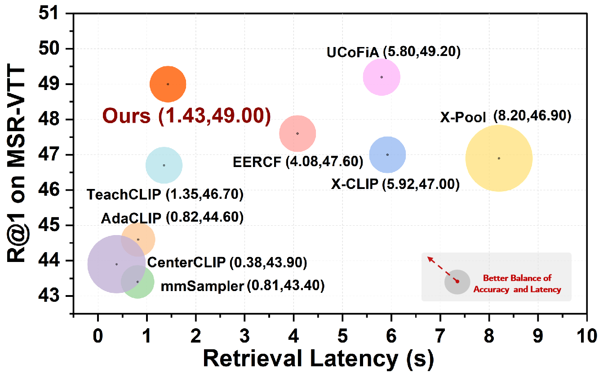
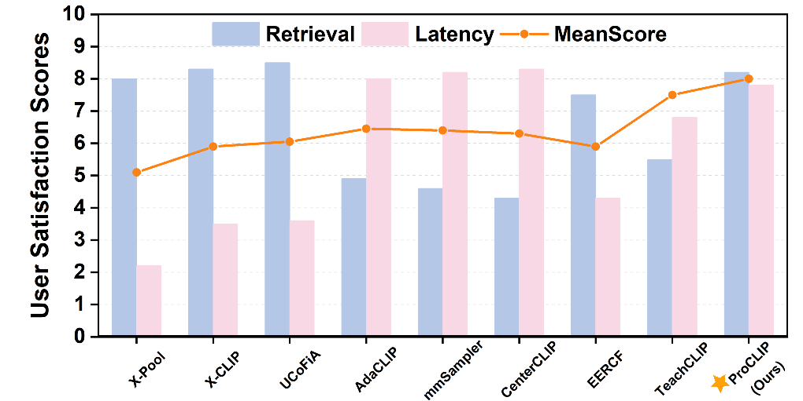

# ProCLIP: Prompt-aware of Frame Sampling for Efficient Text-Video Retrieval

**Author:** 
DEYU ZHANG, School of Computer Science and Engineering, Central South University, China  
TINGTING LONG, School of Computer Science and Engineering, Central South University, China  
JINRUI ZHANG∗, Department of Computer Science and Technology, Tsinghua University, China  
JU REN, Department of Computer Science and Technology, Tsinghua University, China  
YAOXUE ZHANG, Department of Computer Science and Technology, Tsinghua University, China  

**Abstract:** 
Enabling efficient text-video retrieval on edge-end devices is critical for real-world applications. Yet, existing methods face a critical challenge in balancing accuracy and computational efficiency: uniform frame sampling methods ensure content coverage but incur prohibitive computational costs, while salient-frame sampling methods reduce overhead but suffer from query-agnostic frame selection that biases retrieval results. To address this, we propose **ProCLIP**, a user-centric framework that achieves state-of-the-art accuracy with significantly improved efficiency. We design a prompt-aware frame sampling strategy that dynamically guides lightweight feature extractors using textual prompts to select semantically relevant frames, overcoming the limitations of existing salient-frame sampling methods which rely on static, query-agnostic selection criteria. Moreover, we adopt a two-stage candidate pruning strategy that combines rapid coarse filtering via a lightweight module with CLIP-powered fine-grained re-ranking, enhancing retrieval efficiency while preserving accuracy. Experiments across benchmarks show **ProCLIP** achieves __75.3%__ latency reduction versus baselines while maintaining competitive accuracy, i.e., __R@1=49.0__ in MSR-VTT dataset.

 

   
